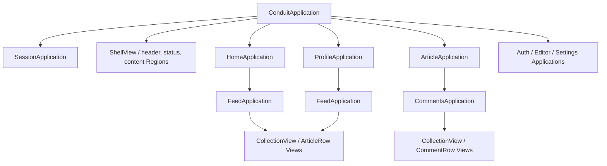

# Ownership and lifecycle

This is a frontend teaching example, with explicit feature lifetimes instead of a controller hidden inside a large View. Read alongside the installed [RC2 architecture guide](../node_modules/marionette/docs/architecture.md) and [records lesson](../node_modules/marionette/docs/records.md).

## Responsibilities

| Owner                                              | Authority and lifetime                                                                                                                                                                                        |
| -------------------------------------------------- | ------------------------------------------------------------------------------------------------------------------------------------------------------------------------------------------------------------- |
| [ConduitApplication](../src/app/application.ts)    | Owns session, page Applications, the shell, browser history and storage listeners. Stops outgoing destinations before starting another. Same-home/profile filter changes call the retained feed owner.        |
| [SessionApplication](../src/app/session.ts)        | Restores a JWT-backed session during preparation, publishes one observable user/status authority, and owns the API client's token access. It has no View.                                                     |
| [HomeApplication](../src/features/home.ts)         | Prepares tags, mounts the home layout, and starts its registered FeedApplication. Home readiness does not pretend to await child feed readiness in a notification hook.                                       |
| [ProfileApplication](../src/features/profile.ts)   | Prepares a profile, owns follow status, and composes profile tabs plus a registered FeedApplication.                                                                                                          |
| [FeedApplication](../src/features/feed.ts)         | Owns query readiness, retry, pagination results, articles collection, and favorite operations. `restart({query})` supersedes older preparation while retaining layout/status/list ownership.                  |
| [ArticleApplication](../src/features/article.ts)   | Prepares article data; one observable model drives both action bars. Body, heading, and action bars live in separate Regions. Coordinates favorite/follow/delete and starts a registered CommentsApplication. |
| [CommentsApplication](../src/features/comments.ts) | Prepares comments; owns collection, composer draft, posting/deletion status, and their cancellation. Specific `comment:*` intents cannot collide with article deletion.                                       |
| [Form Applications](../src/features/forms.ts)      | Own form data and shared save/navigation decisions. Editor preparation checks article ownership; settings uses the already-restored session. The small abstract base shares only save/status/teardown policy. |
| [FormView](../src/features/form-view.ts)           | Owns DOM editing and tag controls, updates borrowed draft models, and emits intent. It never fetches, navigates, or starts another feature.                                                                   |
| [API](../src/shared/api.ts)                        | HTTP envelopes, path encoding, authorization headers, response validation, and errors. Native Models deliberately have no persistence methods.                                                                |

## Readiness, refresh, and writes

`prepareStart` returns required data; `onStart` applies it. The caller owns rejected starts. Page changes use `stop()` then `start()` for reconstruction. Feed filters/pages use `restart()` for retained readiness; Marionette's signal and activation guard prevent stale results, including from an API that ignores abort.

Feed layout, status, and list instances survive readiness refresh. Replacing collection membership intentionally replaces rows. Favorites mutate one row model, so siblings do not rerender. Profile tab updates affect their own View and child feed, without rerendering the profile layout. Article follow/favorite status rerenders its two action bars without replacing the body or comment draft.

Writes have a separate lifetime. [Operation](../src/shared/operation.ts) permits one pending operation per owner (per article for feed favorites), aborts on stop, and checks cancellation before success/failure callbacks. It is not a substitute for Application readiness or lifecycle state. Backend writes may already have committed even if the client stops waiting.

Form drafts belong to their feature Application. Lit updates the form's controls in place; status changes do not replace its View. Comment completion clears only unchanged submitted text. Editor completion navigates only if no newer text was typed. On stop, drafts and pending operations are cleared. There is no hidden draft persistence or compatibility fallback.

## Presentation and event ownership

Views use templates and native delegated bindings. Regions own replacement/destruction. Article and comment records use CollectionView and modelEvents. Small static tag/tab/pagination lists use template iteration because they do not have independent item behavior or observable lifetimes.

Applications use `viewEvents` for root intent and `listenTo` for temporary error/status Views. Destroyed sources release their incoming listeners automatically. There is no blanket `stopListening()` on stop: the root's session subscription must survive stop/start. Native Window listeners are explicitly installed once and removed on stop. The development HMR boundary destroys the root.

Native class fields hold per-instance collections/operations after construction. Framework construction-time configuration uses prototype methods/getters (`createState`, `viewEvents`), avoiding native field initialization overwriting Marionette initialization. Public View instance narrowing is used only where a known layout supplies Regions; no framework internals are read.

## Verification and boundaries

Lifecycle tests inspect public methods and effects: outgoing destruction, borrowed-model listener release, retained root identity on restart, replacement on stop/start, one navigation subscription, child/state destruction, stale preparation that ignores cancellation, and late write suppression.

Deliberate limits: no offline queue, persisted drafts, server implementation, or optimistic rollback machinery. Auth protection in the UI improves navigation but cannot authorize server writes. The RealWorld-required JWT debug interface has the same script access boundary as localStorage.
